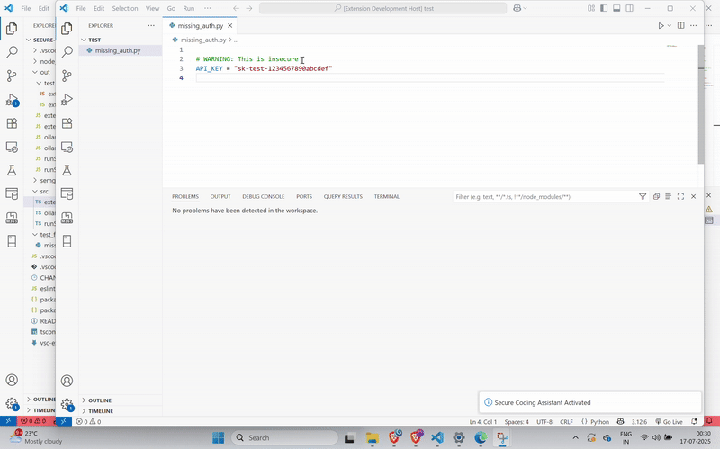

# 🔐 Secure Coding Assistant for VS Code

A real-time security companion for Python developers in VS Code.  
This lightweight extension automatically scans your code for common security issues (like hardcoded secrets and missing auth checks) using **Semgrep**, and suggests **AI-powered one-line fixes** using **CodeLlama via Ollama**.

---

## 🧠 Why This?

AI code tools like GitHub Copilot are great at writing code — but not always securely.  
This extension fills that gap by acting like a **Security Agent** that watches your code and:
- Detects insecure patterns
- Suggests how to fix them securely
- Keeps feedback short and actionable

---

## ✨ Features

- ⚡ Detects security issues using **Semgrep** on file save
- 🤖 Gives **one-line fix suggestions** using **CodeLlama (via Ollama)**
- 💡 Shows popups for quick tips and a full response in the **Output panel**
- 🧠 Acts as a real-time secure coding agent

---

## 🔍 What It Detects

✅ **Hardcoded Secrets**
```python
API_KEY = "sk-test-123456"

---

🚀 How to Run
In VS Code:

Press F5 to open the Extension Development Host

Open a Python file (like test-files/missing_auth.py)

Save the file — results appear immediately

---

## 🎥 Demo


